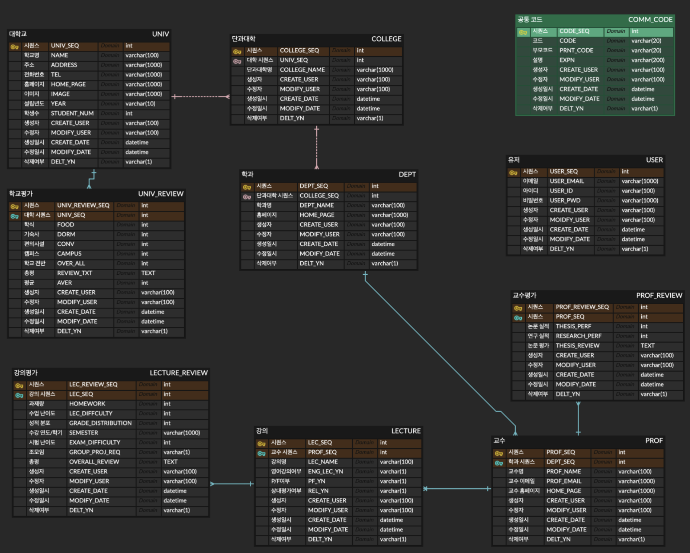

# ⭐Team21_BE UniScope⭐
> 전국 대학 강의 및 교수 평가·탐색·비교 플랫폼
---
## 프로젝트 개요
**유니 스코프(Uni Scope)** 는 “한국형 Rate My Professors”를 목표로 합니다.  
전국 대학의 강의와 교수님을 평가하고, 그 정보를 바탕으로 **검색,탐색,비교**할 수 있는 서비스입니다.

---
## 문제 정의
- 강의와 교수 정보가 학교 커뮤니티에 파편화되어 접근이 어렵다.
- 같은 과목이라도 교수님별 차이를 비교하기 힘들다.
- 대학원 진학 시 연구 분야가 비슷한 교수님을 한눈에 확인하기 어렵다.

---
## 필요성
- 현재 학생들의 의사결정은 입소문과 폐쇄적인 커뮤니티에 의존
- 전국 단위의 투명한 강의·교수 정보 제공이 꼭 필요한 시점

---
## 차별성
- 기존 사이트: 학교 단위, 폐쇄적, 비교 기능 없음
- **유니 스코프**: 전국 단위, 개방형, 비교 중심 서비스

---
## 시장 규모
- 한국 고등 교육 시장: **230만+ 학생**
- 탐·샘·솜 분석을 통해도 수백만 명의 잠재 사용자 존재
- “정보를 모아 제공하기만 해도 성장 가능한 시장”

---
## 💰 비즈니스 모델
1. **광고 기반 모델**: Google AdSense 등
2. **B2B 협업 모델**: 축적된 데이터를 교육 기업·취업 플랫폼과 연계

👉 학생들에게는 무료 제공, 운영에는 지속 가능한 수익 구조 확보

---
# ERD


---
# DB Schema
```
-- 대학
CREATE TABLE UNIV (
    UNIV_SEQ INT PRIMARY KEY,
    NAME VARCHAR(100),
    ADDRESS VARCHAR(1000),
    TEL VARCHAR(100),
    HOME_PAGE VARCHAR(1000),
    IMAGE_URL VARCHAR(1000),
    YEAR VARCHAR(10),
    STUDENT_NUM INT,
    CREATE_USER VARCHAR(100),
    MODIFY_USER VARCHAR(100),
    CREATE_DATE DATETIME,
    MODIFY_DATE DATETIME,
    DELT_YN VARCHAR(1)
);

-- 단과대학
CREATE TABLE COLLEGE (
    COLLEGE_SEQ INT PRIMARY KEY,
    UNIV_SEQ INT,
    COLLEGE_NAME VARCHAR(100),
    CREATE_USER VARCHAR(100),
    MODIFY_USER VARCHAR(100),
    CREATE_DATE DATETIME,
    MODIFY_DATE DATETIME,
    DELT_YN VARCHAR(1),
    FOREIGN KEY (UNIV_SEQ) REFERENCES UNIV(UNIV_SEQ)
);

-- 학과
CREATE TABLE DEPT (
    DEPT_SEQ INT PRIMARY KEY,
    COLLEGE_SEQ INT,
    DEPT_NAME VARCHAR(100),
    HOME_PAGE VARCHAR(1000),
    CREATE_USER VARCHAR(100),
    MODIFY_USER VARCHAR(100),
    CREATE_DATE DATETIME,
    MODIFY_DATE DATETIME,
    DELT_YN VARCHAR(1),
    FOREIGN KEY (COLLEGE_SEQ) REFERENCES COLLEGE(COLLEGE_SEQ)
);

-- 교수
CREATE TABLE PROF (
    PROF_SEQ INT PRIMARY KEY,
    DEPT_SEQ INT,
    PROF_NAME VARCHAR(100),
    PROF_EMAIL VARCHAR(100),
    HOME_PAGE VARCHAR(1000),
    CREATE_USER VARCHAR(100),
    MODIFY_USER VARCHAR(100),
    CREATE_DATE DATETIME,
    MODIFY_DATE DATETIME,
    DELT_YN VARCHAR(1),
    FOREIGN KEY (DEPT_SEQ) REFERENCES DEPT(DEPT_SEQ)
);

-- 사용자
CREATE TABLE USER (
    USER_SEQ INT PRIMARY KEY,
    USER_EMAIL VARCHAR(1000),
    USER_ID VARCHAR(100),
    USER_PWD VARCHAR(100),
    CREATE_USER VARCHAR(100),
    MODIFY_USER VARCHAR(100),
    CREATE_DATE DATETIME,
    MODIFY_DATE DATETIME,
    DELT_YN VARCHAR(1)
);

-- 공통 코드
CREATE TABLE COMM_CODE (
    CODE_SEQ INT PRIMARY KEY,
    CODE VARCHAR(20),
    PRNT_CODE VARCHAR(20),
    EXPN VARCHAR(200),
    CREATE_USER VARCHAR(100),
    MODIFY_USER VARCHAR(100),
    CREATE_DATE DATETIME,
    MODIFY_DATE DATETIME,
    DELT_YN VARCHAR(1)
);

-- 대학 평가
CREATE TABLE UNIV_REVIEW (
    UNIV_REVIEW_SEQ INT PRIMARY KEY,
    UNIV_SEQ INT,
    FOOD INT,
    DORM INT,
    CONV INT,
    CAMPUS INT,
    OVER_ALL INT,
    REVIEW_TXT TEXT,
    AVER INT,
    CREATE_USER VARCHAR(100),
    MODIFY_USER VARCHAR(100),
    CREATE_DATE DATETIME,
    MODIFY_DATE DATETIME,
    DELT_YN VARCHAR(1),
    FOREIGN KEY (UNIV_SEQ) REFERENCES UNIV(UNIV_SEQ)
);

-- 강의
CREATE TABLE LECTURE (
    LEC_SEQ INT PRIMARY KEY,
    PROF_SEQ INT,
    LEC_NAME VARCHAR(100),
    ENG_LEC_YN VARCHAR(1),
    PNF VARCHAR(100),
    REL_YN VARCHAR(1),
    CREATE_USER VARCHAR(100),
    MODIFY_USER VARCHAR(100),
    CREATE_DATE DATETIME,
    MODIFY_DATE DATETIME,
    DELT_YN VARCHAR(1),
    FOREIGN KEY (PROF_SEQ) REFERENCES PROF(PROF_SEQ)
);

-- 강의 평가
CREATE TABLE LECTURE_REVIEW (
    LEC_REVIEW_SEQ INT PRIMARY KEY,
    LEC_SEQ INT,
    HOMEWORK INT,
    LEC_DIFFICULTY INT,
    GRADE_DISTRIBUTION VARCHAR(100),
    SEMESTER VARCHAR(100),
    EXAM_DIFFICULTY INT,
    GROUP_PROJ_REO INT,
    OVERALL_REVIEW INT,
    REVIEW_TXT TEXT,
    CREATE_USER VARCHAR(100),
    MODIFY_USER VARCHAR(100),
    CREATE_DATE DATETIME,
    MODIFY_DATE DATETIME,
    DELT_YN VARCHAR(1),
    FOREIGN KEY (LEC_SEQ) REFERENCES LECTURE(LEC_SEQ)
);

-- 교수 평가
CREATE TABLE PROF_REVIEW (
    PROF_REVIEW_SEQ INT PRIMARY KEY,
    PROF_SEQ INT,
    THESIS_PERF INT,
    RESEARCH_PERF INT,
    THESIS_REVIEW TEXT,
    CREATE_USER VARCHAR(100),
    MODIFY_USER VARCHAR(100),
    CREATE_DATE DATETIME,
    MODIFY_DATE DATETIME,
    DELT_YN VARCHAR(1),
    FOREIGN KEY (PROF_SEQ) REFERENCES PROF(PROF_SEQ)
);
```

---
## 📖 API 명세

| 기능         | 메서드 | 엔드포인트           | 설명         |
| :--- | :--- | :--- | :--- |
| 회원가입     | POST   | /api/users/signup  | 새로운 회원 등록 |
| 로그인       | POST   | /api/users/login   | 로그인     |
| 통합 검색    | GET    | /api/search        | 다양한 조합의 검색 기능 |
| 대학 정보 조회 | GET | /api/univ/{univ_seq} | 특정 대학의 상세 정보 및 리뷰 조회 |
| 교수 정보 조회 | GET | /api/prof/{prof_seq} | 특정 교수의 상세 정보 및 리뷰/강의 목록 조회 |
| 강의 리뷰 작성 | POST | `/api/reviews/lecture` | 새로운 강의 리뷰 등록 |

<br>

➡️ **전체 API 문서**: [여기서 확인하세요](https://teamsparta.notion.site/API-2632dc3ef51480898ed6fa3248ae4c7d)

---
