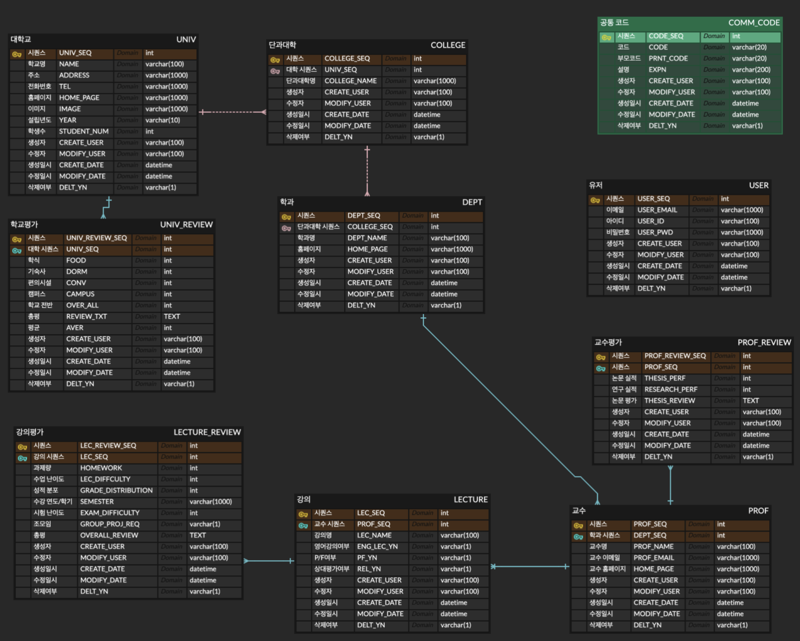

# ⭐Team21_BE UniScope⭐
> 전국 대학 강의 및 교수 평가·탐색·비교 플랫폼
---
## 프로젝트 개요
**유니 스코프(Uni Scope)** 는 “한국형 Rate My Professors”를 목표로 합니다.  
전국 대학의 강의와 교수님을 평가하고, 그 정보를 바탕으로 **검색,탐색,비교**할 수 있는 서비스입니다.

## 📝 서비스 소개

> “한눈에 비교하고, 믿을 수 있는 데이터를 기반으로 선택하세요.”

**UniScope**는 대학 생활의 모든 순간에 필요한 정보를 제공합니다.  
학점 교류를 고민하는 대학생, 대학원 진학을 고려하는 대학생,  
그리고 대입을 준비하는 고등학생까지 -  
모두가 더 나은 선택을 할 수 있도록 돕는 **대학 정보 통합 플랫폼**입니다.

해외에는 이미 **RateMyProfessor** 등  
학생들이 직접 강의와 교수를 평가하고 공유하는 플랫폼이 활발히 운영되고 있습니다.  
하지만 국내에서는 이러한 통합 플랫폼이 없고, 정보가 파편화되어 있습니다.

**UniScope**는 그 공백을 메우기 위해 시작되었습니다.  
학생들이 더 객관적이고, 더 나은 선택을 할 수 있도록 돕습니다.

---
## 문제 정의
- 강의와 교수 정보가 학교 커뮤니티에 파편화되어 접근이 어렵다.
- 같은 과목이라도 교수님별 차이를 비교하기 힘들다.
- 대학원 진학 시 연구 분야가 비슷한 교수님을 한눈에 확인하기 어렵다.

---
## 필요성
- 현재 학생들의 의사결정은 입소문과 폐쇄적인 커뮤니티에 의존
- 전국 단위의 투명한 강의·교수 정보 제공이 꼭 필요한 시점

---
## 차별성
- 기존 사이트: 학교 단위, 폐쇄적, 비교 기능 없음
- **유니 스코프**: 전국 단위, 개방형, 비교 중심 서비스

---
## 시장 규모
- 한국 고등 교육 시장: **230만+ 학생**
- 탐·샘·솜 분석을 통해도 수백만 명의 잠재 사용자 존재
- “정보를 모아 제공하기만 해도 성장 가능한 시장”

---
# ERD


---

# DB Schema
```
create table career_field
(
    CAREER_FIELD_SEQ bigint auto_increment
        primary key,
    FIELD_NAME       varchar(100) not null comment '진로 분야 이름 (예: 백엔드, 프론트엔드)',
    constraint UK_FIELD_NAME
        unique (FIELD_NAME)
)
    comment '진로/취업 분야 분류 기준';

create table univ
(
    UNIV_SEQ         bigint auto_increment
        primary key,
    NAME             varchar(100)  not null comment '학교 이름',
    ADDRESS          varchar(1000) null comment '학교 주소',
    TEL              varchar(20)   null comment '학교 전화번호',
    HOME_PAGE        varchar(1000) null comment '학교 홈페이지 URL',
    IMAGE_URL        varchar(1000) null comment '학교 이미지 URL',
    ESTABLISHED_YEAR varchar(10)   null comment '설립 연도 (YYYY)',
    STUDENT_NUM      int           null comment '총 학생 수',
    CAMPUS_CNT       int           null comment '캠퍼스 수',
    constraint UK_UNIV_NAME
        unique (NAME)
)
    comment '대학교 기본 정보';

create table college
(
    COLLEGE_SEQ              bigint auto_increment
        primary key,
    UNIV_SEQ                 bigint        not null comment '소속 대학교 고유번호',
    COLLEGE_NAME             varchar(100)  not null comment '단과대학 이름',
    COLLEGE_STUDENT_NUM      int           null comment '단과대학 학생 수',
    COLLEGE_ESTABLISHED_YEAR varchar(10)   null comment '설립 연도 (YYYY)',
    COLLEGE_TEL              varchar(20)   null comment '대표 전화번호',
    COLLEGE_HOME_PAGE        varchar(1000) null comment '홈페이지 URL',
    COLLEGE_INTRO            text          null comment '단과대학 한 줄 소개',
    constraint FK_UNIV_TO_COLLEGE
        foreign key (UNIV_SEQ) references univ (UNIV_SEQ)
)
    comment '단과대학 정보';

create table dept
(
    DEPT_SEQ              bigint auto_increment
        primary key,
    COLLEGE_SEQ           bigint        not null comment '소속 단과대학 고유번호',
    DEPT_NAME             varchar(100)  not null comment '학과 이름',
    HOME_PAGE             varchar(1000) null comment '학과 홈페이지 URL',
    DEPT_ADDRESS          varchar(1000) null comment '학과 주소',
    DEPT_TEL              varchar(20)   null comment '학과 대표 전화번호',
    DEPT_EMAIL            varchar(100)  null comment '학과 대표 이메일',
    DEPT_ESTABLISHED_YEAR varchar(10)   null comment '설립 연도 (YYYY)',
    DEPT_INTRO            text          null comment '학과 한 줄 소개',
    DEPT_STUDENT_NUM      int           null comment '학과 재학생 수',
    EMPLOYMENT_RATE       double        null comment '학과 취업률',
    DEPT_FAX              varchar(20)   null comment '학과 팩스 번호',
    DEPT_TAGS             varchar(255)  null comment '학과 관련 태그 (쉼표로 구분)',
    constraint FK_COLLEGE_TO_DEPT
        foreign key (COLLEGE_SEQ) references college (COLLEGE_SEQ)
)
    comment '학과 정보';

create table dept_career_field
(
    DEPT_SEQ         bigint not null comment '학과 고유번호 (FK)',
    CAREER_FIELD_SEQ bigint not null comment '진로 분야 고유번호 (FK)',
    primary key (DEPT_SEQ, CAREER_FIELD_SEQ),
    constraint FK_DEPT_JUNCTION
        foreign key (DEPT_SEQ) references dept (DEPT_SEQ),
    constraint FK_FIELD_JUNCTION
        foreign key (CAREER_FIELD_SEQ) references career_field (CAREER_FIELD_SEQ)
)
    comment '학과-진로 분야 연결 테이블';

create table prof
(
    PROF_SEQ       bigint auto_increment
        primary key,
    DEPT_SEQ       bigint        not null comment '소속 학과 고유번호',
    PROF_NAME      varchar(100)  not null comment '교수 이름',
    PROF_EMAIL     varchar(100)  null comment '교수 이메일',
    HOME_PAGE      varchar(1000) null comment '교수 홈페이지 URL',
    OFFICE         varchar(100)  null comment '사무실 정보 (예: 공5601)',
    POSITION       varchar(50)   null comment '교수 직책 (예: 교수, 조교수)',
    IMAGE_URL      varchar(1000) null comment '교수 사진 URL',
    MAJOR          varchar(255)  null comment '전공',
    RESEARCH_FIELD varchar(255)  null comment '연구 분야',
    DEGREE         varchar(255)  null comment '학력',
    constraint UK_PROF_EMAIL
        unique (PROF_EMAIL),
    constraint FK_DEPT_TO_PROF
        foreign key (DEPT_SEQ) references dept (DEPT_SEQ)
)
    comment '교수 기본 정보';

create table lecture
(
    LEC_SEQ  bigint auto_increment
        primary key,
    PROF_SEQ bigint       not null comment '담당 교수 고유번호',
    LEC_NAME varchar(100) not null comment '강의 이름',
    PF_YN    char         null comment 'Pass/Fail 여부 (Y/N)',
    constraint FK_PROF_TO_LECTURE
        foreign key (PROF_SEQ) references prof (PROF_SEQ)
)
    comment '강의 정보';

create table lecture_review
(
    LEC_REVIEW_SEQ     bigint auto_increment
        primary key,
    LEC_SEQ            bigint      not null comment '소속 강의 고유번호',
    HOMEWORK           int         null comment '과제량 평점 (1~5)',
    LEC_DIFFICULTY     int         null comment '강의 난이도 평점 (1~5)',
    GRADE_DISTRIBUTION int         null comment '학점 분포 평점 (1~5)',
    EXAM_DIFFICULTY    int         null comment '시험 난이도 평점 (1~5)',
    SEMESTER           varchar(50) null comment '수강 학기',
    GROUP_PROJ_REQ     char        null comment '그룹 프로젝트 여부 (Y/N)',
    OVERALL_REVIEW     text        null comment '전반적인 리뷰 내용',
    CREATE_DATE        datetime    null comment '리뷰 작성일시',
    constraint FK_LECTURE_TO_LECTURE_REVIEW
        foreign key (LEC_SEQ) references lecture (LEC_SEQ)
)
    comment '강의 평가 정보';

create table prof_review
(
    PROF_REVIEW_SEQ bigint auto_increment
        primary key,
    PROF_SEQ        bigint   not null comment '소속 교수 고유번호',
    THESIS_PERF     int      null comment '논문 실적 평점 (1~5)',
    RESEARCH_PERF   int      null comment '연구 실적 평점 (1~5)',
    THESIS_REVIEW   text     null comment '논문 관련 상세 리뷰 내용',
    CREATE_DATE     datetime null comment '리뷰 작성일시',
    constraint FK_PROF_TO_PROF_REVIEW
        foreign key (PROF_SEQ) references prof (PROF_SEQ)
)
    comment '교수 평가 정보';

create table univ_review
(
    UNIV_REVIEW_SEQ bigint auto_increment
        primary key,
    UNIV_SEQ        bigint   not null comment '소속 대학교 고유번호',
    FOOD            int      null comment '학식 평점 (1~5)',
    DORM            int      null comment '기숙사 평점 (1~5)',
    CONV            int      null comment '편의시설 평점 (1~5)',
    CAMPUS          int      null comment '캠퍼스 환경 평점 (1~5)',
    WELFARE         int      null comment '학생 복지 점수 (1~5)',
    REVIEW_TXT      text     null comment '리뷰 상세 내용',
    CREATE_DATE     datetime null comment '리뷰 작성일시',
    constraint FK_UNIV_TO_UNIV_REVIEW
        foreign key (UNIV_SEQ) references univ (UNIV_SEQ)
)
    comment '대학 평가 정보';

create table users
(
    USER_SEQ    bigint auto_increment
        primary key,
    USER_EMAIL  varchar(255)                       not null comment '사용자 이메일 (로그인, 고유)',
    USER_ID     varchar(100)                       not null comment '사용자 아이디 (로그인, 고유)',
    USER_PWD    varchar(255)                       not null comment '사용자 비밀번호 (암호화됨)',
    CREATE_USER varchar(100)                       null comment '생성자',
    MODIFY_USER varchar(100)                       null comment '수정자',
    CREATE_DATE datetime default CURRENT_TIMESTAMP null comment '생성일시',
    MODIFY_DATE datetime default CURRENT_TIMESTAMP null on update CURRENT_TIMESTAMP comment '수정일시',
    DELT_YN     char     default 'N'               null comment '삭제 여부 (Y/N)',
    constraint UK_USER_EMAIL
        unique (USER_EMAIL),
    constraint UK_USER_ID
        unique (USER_ID)
)
    comment '사용자 계정 정보';


```

---
## 📖 API 명세

| 기능         | 메서드 | 엔드포인트           | 설명         |
| :--- | :--- | :--- | :--- |
| 회원가입     | POST   | /api/users/signup  | 새로운 회원 등록 |
| 로그인       | POST   | /api/users/login   | 로그인     |
| 통합 검색    | GET    | /api/search        | 다양한 조합의 검색 기능 |
| 대학 정보 조회 | GET | /api/univ/{univ_seq} | 특정 대학의 상세 정보 및 리뷰 조회 |
| 교수 정보 조회 | GET | /api/prof/{prof_seq} | 특정 교수의 상세 정보 및 리뷰/강의 목록 조회 |
| 강의 리뷰 작성 | POST | `/api/reviews/lecture` | 새로운 강의 리뷰 등록 |

<br>

➡️ **전체 API 문서**: [여기서 확인하세요](http://13.125.1.77:8080/swagger-ui/index.html)

---

## 🔧 기술 스택

| 분야                           | 기술 스택                                                    |
| :----------------------------- | :----------------------------------------------------------- |
| **Backend Framework**          | Spring Boot (Java) |
| **Persistence (ORM)**          | Spring Data JPA · Hibernate                                  |
| **Database**                   | MySQL                                                        |
| **API & Protocol**             | RESTful API                                                  |
| **Authentication & Security**  | JWT (JSON Web Tokens) · Spring Security                      |
| **External Service**           | SMTP (이메일 발송)                                            |
| **Deployment / Infra**         | AWS EC2 (Server Hosting)                                     |
| **CI / CD**                    | GitHub Actions                                               |

